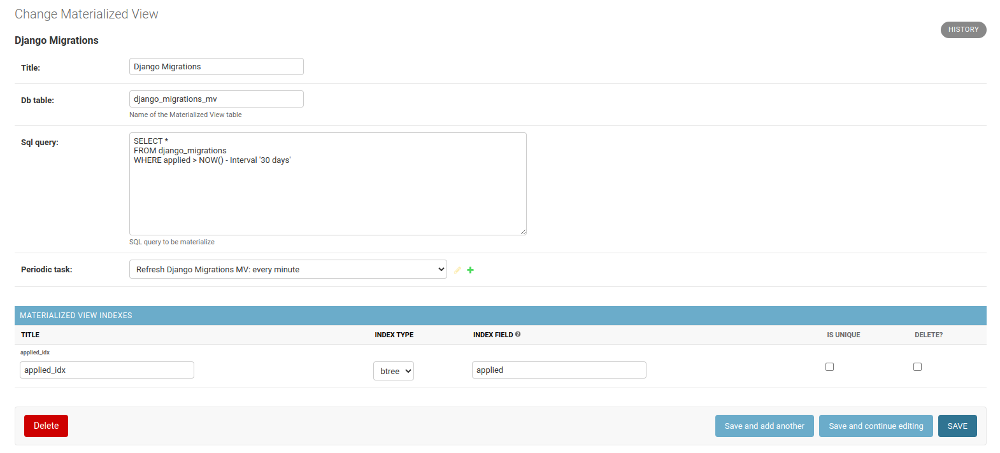

# Django Materialized Views

# Overview

Django Materialized Views is a powerful admin tool for managing materialized views through the admin panel 



The tool can:
* Create, update and delete materialized views
* Add indexes on the materialized views
* Periodically refresh the materialized views for a given interval

Limitation:
* Works only with PostgreSQL

# Requirements
* Python 3.6+
* Django 4.1, 4.0, 3.2, 3.1, 3.0, 2.2


# Installation
Install using pip
```
pip install dj_materialized_views 
```

Add 'dj_materialized_views' to your INSTALLED_APPS setting
```
INSTALLED_APPS = [
    ...
    'dj_materialized_views',
]
```