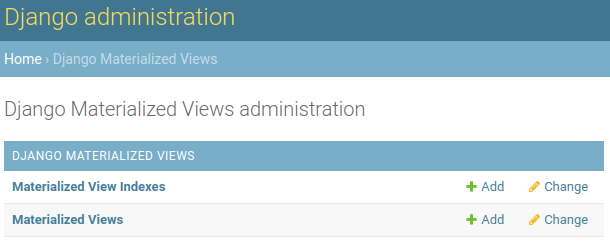

# Quick start

## Overview

Two new admin models have been added to the app

The final step is to create a Materialized View entry and then perform the 
`Create Materialized View` admin action on that entry

## Create Materialized View Entry

* `Title` - This entry's title
* `DB Table` - The name of the database table
* `SQL Query` - The query that represents the database table
* `Periodic Task` - How frequently do you want this table to be refreshed? Only three fields are required:
    * `Name` - the task's name
    * `Task (custom)` - this will be linked to the correct celery task automatically
    * `Interval Schedule` - how frequently the task should be run
    

* `Indexes` -  concurrent refreshing requires at least one index

## Run the `Create Materialized View` admin action

Here's a detailed explanation of what these admin actions do:

* `Create Materialized View` - creates the materialized view in the database and enables the periodic refresh task
* `Refresh Materialized View` - useful if you want to manually refresh the materialized view
* `Drop Materialized View` - removes the materialized view from the database and disables the periodic refresh task
* `Delete selected Materialized View` - deletes the materialized view from the database and from the admin panel